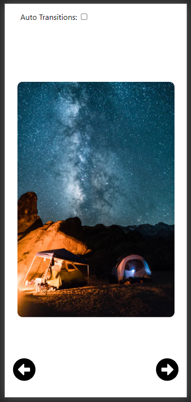

# React Image Carousel

This is an Image Carousel/Image Slider Component built using React.

- Built using React Hooks
- Responsive Design

## **[Live Demo](https://react-image-carousel-v1.netlify.app/)**

### Getting Started with Create React App

This project was bootstrapped with [Create React App](https://github.com/facebook/create-react-app).

### Running Locally

Clone the project and run **_npm install_**, then run **_npm start_**

### `npm install`

Run this command in the directory where package.json file is located. This will install all the required dependencies for the project.

### `npm start`

Runs the app in the development mode.\
Open [http://localhost:3000](http://localhost:3000) to view it in the browser.
